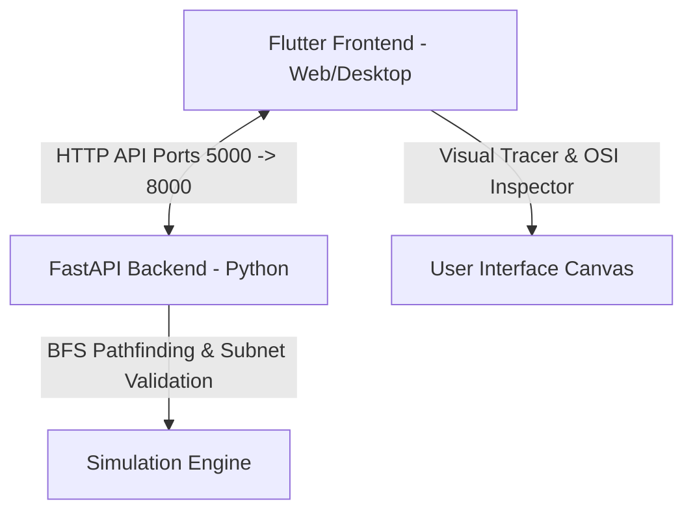

# NetVisual Academy: Interactive Network Learning Simulator

NetVisual Academy is an interactive tool designed to help students and developers visualize network topologies, track packet transmission step-by-step, and inspect headers across different layers of the OSI model. The project features a gamified **Troubleshooting Lab** with levels that challenge users to diagnose and repair network faults (e.g., broken cables, IP subnet mismatches), as well as complete **Topology Save / Load & JSON Export** capabilities.

### Key Features
* 🧮 **Subnet Calculator Modal**: Calculate network IDs, broadcast IPs, wildcard masks, usable host ranges, and binary representations on the fly.
* 🦈 **Wireshark-Style Packet Inspector**: Click any packet to view deep Ethernet II, IPv4, and ICMP protocol trees with side-by-side hex dump and decoded text.
* ↩️ **Undo / Redo System**: Full history stack with keyboard shortcut support (`Ctrl+Z` to undo, `Ctrl+Y` / `Ctrl+Shift+Z` to redo).
* ⚡ **Chaos Fault Scenario Injector**: Inject unexpected network faults (duplicate IPs, shutdown ports, broken cables, subnet conflicts) with one click.
* ⏱️ **Time Attack Mode**: Fix network misconfigurations against a 60-second countdown timer for bonus XP multipliers.
* 📝 **Post-Lab Quiz Engine**: Theoretical knowledge checks after lab sessions to verify learning before unlocking module completion.
* 💾 **Save & Load JSON Topologies**: Export custom network layouts as `.json` files or import existing topology files.
* 📋 **JSON Code Inspector & Presets**: Copy topology definitions to the clipboard or instantly load sample presets (e.g., Basic LAN, Dual Subnet Router).
* 🔌 **Hands-On Physical Cable Selection**: Choose between Straight-Through, Crossover, Fiber, and Console cables with live compatibility checks.
* 🖥️ **Device Config & Interactive Terminal**: Configure IP addresses, subnet masks, default gateways, toggle administrative port states (UP/DOWN), and execute CLI commands (`ping`, `ipconfig`, `show ip route`).
* 📊 **OSI 7-Layer Packet Breakdown**: Step-by-step visual packet animation and layer encapsulation inspection.

---

## System Architecture



* **Frontend**: Built with Flutter (Web/Desktop targets).
* **Backend**: Powered by FastAPI (Python), handling topology validation, pathfinding, and subnet checking.

---

## Prerequisites

Before starting, ensure you have the following installed on your machine:

1. **Python 3.10 or higher**: [Download Python](https://www.python.org/downloads/)
2. **Flutter SDK (Stable Channel)**: [Flutter Get Started Guide](https://docs.flutter.dev/get-started/install)
3. A web browser (Google Chrome or Microsoft Edge recommended) or native desktop tools (C++ tools for Windows).

---

## Quick Start Guide

Follow these steps to set up and run both the backend and frontend.

### 1. Configure and Run the Backend (FastAPI)

1. Open your terminal and navigate to the `backend` directory:
   ```bash
   cd backend
   ```

2. Create a virtual environment:
   ```bash
   python -m venv .venv
   ```

3. Activate the virtual environment:
   * **Windows (PowerShell)**:
     ```powershell
     .\.venv\Scripts\Activate.ps1
     ```
   * **Windows (Command Prompt)**:
     ```cmd
     .\.venv\Scripts\activate.bat
     ```
   * **macOS / Linux**:
     ```bash
     source .venv/bin/activate
     ```

4. Install the backend dependencies:
   ```bash
   pip install -r requirements.txt
   ```

5. Start the API server:
   ```bash
   python main.py
   ```
   * The backend will run on `http://127.0.0.1:8000`.
   * You can test the connection by visiting `http://127.0.0.1:8000/health` (should return `{"status":"ok"}`).
   * The interactive API docs are available at `http://127.0.0.1:8000/docs`.

---

### 2. Configure and Run the Frontend (Flutter)

1. Open a new terminal window and navigate to the `frontend` directory:
   ```bash
   cd frontend
   ```

2. Run a environment doctor check (optional, to verify your Flutter environment):
   ```bash
   flutter doctor
   ```

3. Fetch the required Flutter packages:
   ```bash
   flutter pub get
   ```

4. Run the frontend application:
   * **Run on Chrome (Web)**:
     ```bash
     flutter run -d chrome
     ```
   * **Run on Web Server** (useful for headless setups or remote testing):
     ```bash
     flutter run -d web-server --web-port=5000 --web-hostname=127.0.0.1
     ```
   * **Run on Native Windows Desktop** (requires Visual Studio with C++ desktop development):
     ```bash
     flutter run -d windows
     ```

---

## Project Structure

```
LearningSimulator/
├── backend/
│   ├── app/
│   │   ├── models/            # Pydantic models for simulation API
│   │   ├── routes/            # FastAPI route controllers
│   │   ├── services/          # Business logic (simulation & validation)
│   │   └── simulation/
│   ├── main.py                # Server entrypoint with CORS middleware setup
│   └── requirements.txt       # Python dependencies list
└── frontend/
    ├── lib/
    │   ├── models/            # Flutter network schemas (Device, Connection, etc.)
    │   ├── screens/           # Dashboard, Simulator, Troubleshooting, Settings views
    │   ├── services/          # SimulatorState manager & HTTP API service client
    │   ├── theme/             # Premium light/dark color definitions
    │   └── widgets/           # Sidebar, NetworkCanvas, OSI Inspector, Toolbox
    └── pubspec.yaml           # Flutter dependencies and assets configuration
```

---

## Troubleshooting & Tips

* **CORS Blocked Errors**: 
  The FastAPI backend in `main.py` is configured with `CORSMiddleware` using `allow_origins=["*"]` to allow local Flutter web application requests. Ensure your browser isn't using extensions that strip CORS headers.
* **Backend Connection Status Indicator**:
  The bottom right of the Simulator screen contains a status circle. If it shows **Disconnected**, verify that the FastAPI backend is running on port `8000` and there is no firewall blocking port `8000`.
* **Port Conflicts**:
  If port `8000` (backend) or port `5000` (frontend web-server) is already in use, you can run them on custom ports:
  * Backend: Edit `main.py` (`port=XXXX`) or run `uvicorn main:app --port=XXXX`
  * Frontend: `flutter run -d web-server --web-port=XXXX`
